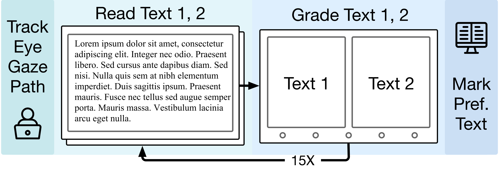

# GREAT

**G**aze **R**esponses for **E**valuating **A**I **T**exts is an English corpus of eye movements in reading with 38 participants and 487 pairs of valid recorded eye tracking data. The dataset was collected using Tobii Pro Spark eye tracker, operating at a sampling rate of 60 Hz.
## summary
This dataset is a curated eye-movement corpus linking **reading materials**, **word-level linguistic annotations**, and **fine-grained gaze trajectories**. It is designed to support research on cognitive processing in language understanding, reading behavior modeling, and the interaction between text difficulty, linguistic features, and eye-tracking signals. The reading materials include model-generated texts (e.g., Alpaca-13B and others), allowing analysis of how readers process outputs from different language models. To facilitate analyses, we further provide precomputed text annotations: word length, frequency and surprisal, as well as part-of-speech tags and syntactic dependency trees.

The dataset consists of three aligned CSV files:

### **Text_data.csv**

Contains sentence-level information for each stimulus text:

* **MODEL**: Source model of the text.
* **TEXT**: Full sentence content.
* **SENTENCEID**: Sentence index within the document.
* **NLL**: Sentence-level negative log-likelihood.

### **Word_Infor.csv**

Provides detailed lexical and syntactic features for every word:

* **WORD**, **WORD_LEN**, **NW**, **PAR_WORD_NUM**
* **Word frequency**
* **Universal POS**, **PTB POS**
* **Dependency relations**, **head index**, **distance to head**
* **Named entity tag**, **morphological features**
* **Left/right dependent counts**
* **Word-level NLL**

These annotations support token-level analyses such as surprisal–gaze correlations, syntactic complexity effects, and lexical processing difficulty.

### **Fixations_Para.csv**

Includes fixation- and saccade-level measurements aligned to the word indices:

* **TRIAL_ID**, **PARTICIPANT_ID**
* **SENTENCEID**, **CURRENT_FIX_INTEREST_AREA_ID**
* **Fixation duration**, **X/Y gaze position**
* **Saccade duration**, **amplitude**, **direction**
* **Word region labels** and normalized spatial distances

This file captures the temporal dynamics of gaze behavior and enables modeling of fixation prediction, scanpath generation, and attention allocation.

### Experiment Structure

Participants completed 15 sessions, each involving the sequential reading of two texts while their eye gaze was recorded. After reading, participants rated their relative preference for the texts using a five-point scale displayed beneath the text pairs on the grading interface.

